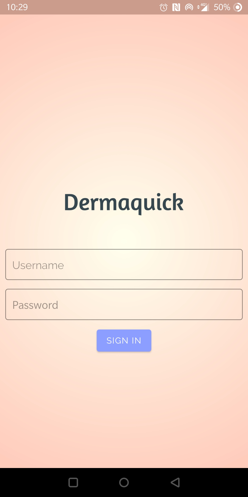
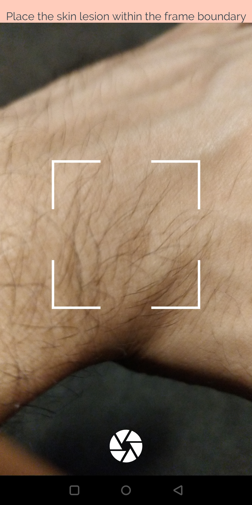
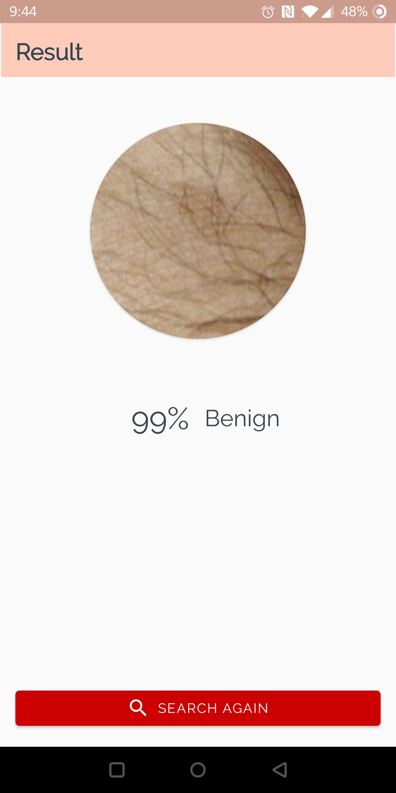

# DermaQuick
Android app to detect melanoma skin lesions 

<b>
Note: 
This is not a complete app but a prototype designed to test the ability to run a fully trained CNN model on android device. 
</b> 

<h2>Dataset Source</h2>
https://www.isic-archive.com/#!/topWithHeader/onlyHeaderTop/gallery

<h2> Screenshots </h2> 

